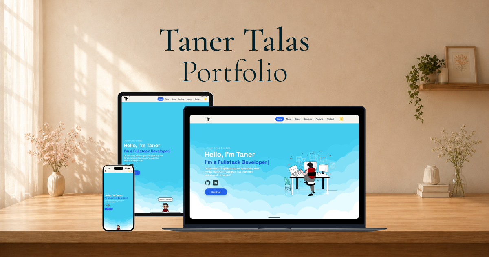

<div align="center">


# Taner Talas — Developer Portfolio

**A hand-built portfolio with a sky that changes with the theme, clouds that drift,
and a little pixel version of me who walks in while you read.**

[](https://tanertalas-portfolio.vercel.app)
&nbsp;




</div>

---

## Contents

- [What it is](#what-it-is)
- [Featured work](#featured-work)
- [The details worth noticing](#the-details-worth-noticing)
- [Stack](#stack)
- [Getting started](#getting-started)
- [Project layout](#project-layout)
- [Adding a project](#adding-a-project)
- [Deploying](#deploying)
- [Contact](#contact)

---

## What it is

My personal portfolio — designed, built and maintained entirely by me. No template,
no page builder, no UI kit. Every section, animation and SVG in this repo was made
for this site.

It is a single-page React app with one extra route for the full project catalogue.
The whole thing is static: no backend, no database, no analytics.

---

## Featured work

The two cards on the home page, plus everything else on `/projects`:

| Project | What it is | Built with |
| --- | --- | --- |
| **[Solar System Journey](https://solar-system-journey-plum.vercel.app)** | A 3D flight from the Sun out to Neptune at true spacing | Next.js · TypeScript · Three.js · Tailwind |
| **[Logo Quiz](https://logo-quiz-lake.vercel.app)** | Guess the brand behind the blurred logo | Next.js · TypeScript · Tailwind · PostgreSQL |
| **[Guess the Flag](https://guess-the-flag-khw0.onrender.com)** | Countries-of-the-world flag quiz | React · Tailwind · Node · SQLite |
| **[Braci](https://tanertalas.github.io/BRACI/)** | Pizza restaurant website | HTML · CSS · Tailwind · JS |
| **[TinCat](https://tanertalas.github.io/TinCat/)** | Cat dating app landing page | HTML · CSS · Bootstrap · JS |

<sub>…and more on the [projects page](https://tanertalas-portfolio.vercel.app/projects).</sub>

---

## The details worth noticing

**A sky, not a background.** The header is a live scene: layered SVG clouds drifting
at different speeds, wind streaks crossing behind them, and a sun that rises or sets
when you flip the theme — the whole cloud set swaps between a light and a dark
variant rather than just dimming.

**The mini me.** A small character assembled from separate SVG parts (head, body,
hands, stick) that runs a timed animation sequence while you sit on the hero.

**Themes that persist.** The palette is a set of CSS custom properties on `:root` and
`.dark`; the toggle flips one class on `<html>` and stores the choice, so a reload
keeps the mood you picked.

**Motion that follows you.** [Lenis](https://github.com/darkroomengineering/lenis)
smooths the scroll, an `IntersectionObserver` reveals each block as it enters the
viewport, and a scroll-spy keeps the nav in sync with the section you are reading.

**A typewriter hero.** The headline types itself out one character at a time when the
page opens, with a blinking caret trailing behind it.

**Projects as browser windows.** Each project card is a mock browser — traffic-light
chrome, a URL bar with the real domain, and a screenshot that zooms a little when you
hover it.

**Responsive down to a phone.** Every section reflows; the nav collapses into a
mobile menu.

---

## Stack

| Layer | Choice | Why |
| --- | --- | --- |
| UI | **React 19** | Component-per-section, data-driven cards |
| Build | **Vite 8** | Instant dev server, tiny production bundle |
| Styling | **Tailwind CSS 4** | Utility-first, with theme tokens as CSS variables |
| Routing | **React Router 7** | `/` and `/projects`, client-side |
| Scroll | **Lenis** | Smooth scrolling that plays well with the reveals |

Content lives in plain data files under `src/data/` — projects, services, skills and
nav links — so the site is edited by changing data, not markup.

---

## Getting started

```bash
npm install      # install dependencies
npm run dev      # start the dev server
npm run build    # build for production
npm run preview  # preview the production build
```

---

## Project layout

```
public/img/          # All artwork: clouds, character, tool icons, project shots
src/
├── components/
│   ├── effects/     # Clouds, Wind, MiniMe — the decorative layer
│   ├── layout/      # Navbar, Footer
│   ├── sections/    # Hero, About, Services, Stack, Projects, Contact
│   └── ui/          # ProjectCard, SectionHeading, Reveal
├── data/            # projects.js, services.js, skills.js, navLinks.js
├── hooks/           # useTheme, useLenis, useScrollSpy, useTypewriter, useInView
├── pages/           # HomePage, ProjectsPage
├── App.jsx          # Routes and layout
└── main.jsx         # Entry point
```

---

## Adding a project

One entry in `src/data/projects.js` — the home preview takes the first two, the
projects page renders the whole list, so order is priority:

```js
{
  name: "Solar System Journey",
  tagline: "3D flight from the Sun out to Neptune",
  urlLabel: "solar-system-journey-plum.vercel.app",
  image: "/img/projects/solar-system-journey.png",
  live: "https://solar-system-journey-plum.vercel.app",
  github: "https://github.com/TanerTalas/Solar-System-Journey",
  tech: ["Next.js", "TypeScript", "Three.js", "Tailwind"],
}
```

Drop the screenshot in `public/img/projects/` at **1981 × 1400** to match the rest.
New technology in the stack section? Add its SVG under
`public/img/toolicons/<category>/` and one line in `src/data/skills.js`.

---

## Deploying

Hosted on **Vercel**. `vercel.json` rewrites every path to `index.html`, so
`/projects` still resolves on a direct visit or a refresh. Pushing to `main` ships it.

---

## Contact

<div align="center">

**[tanertalas.dev@gmail.com](mailto:tanertalas.dev@gmail.com)**

[](https://github.com/TanerTalas)
&nbsp;
[](https://www.linkedin.com/in/tanertalas/)

</div>

---

## License

[MIT](LICENSE) — take what is useful, just don't ship it as your own portfolio.
